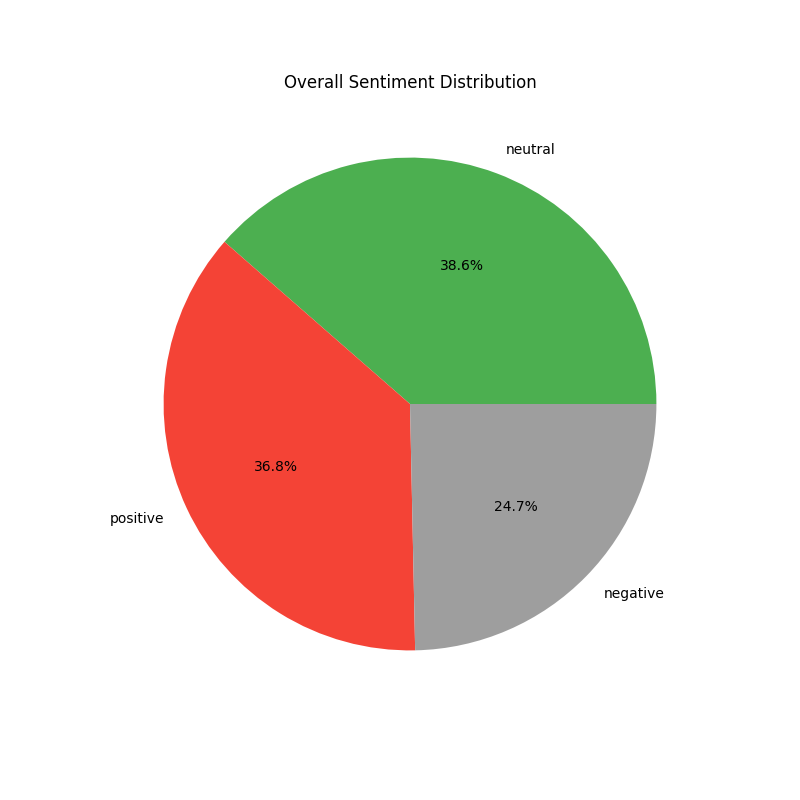
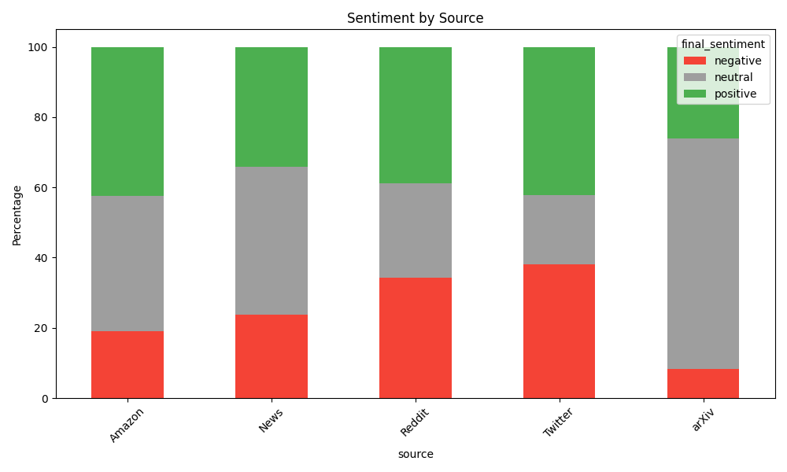
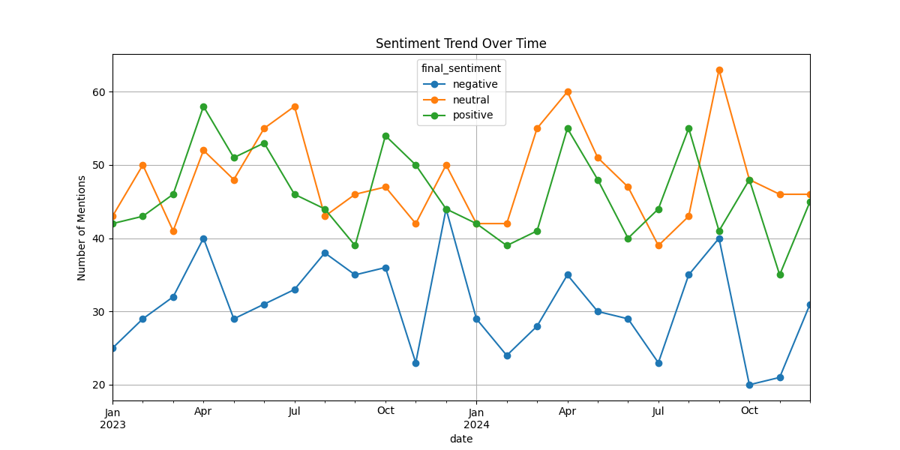
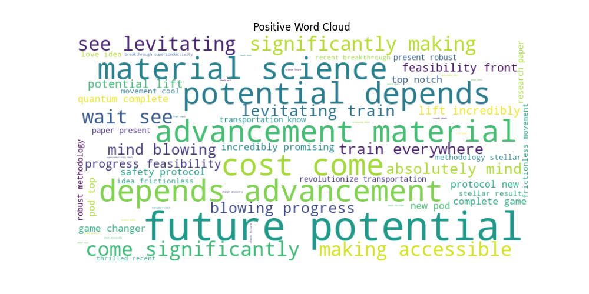
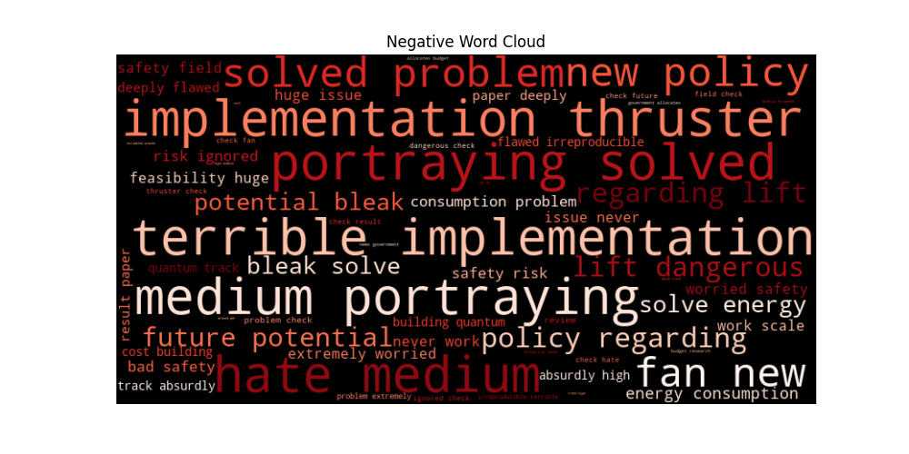

# Levitation Tech Sentiment Analysis - Visual Representations

Here are the visual representations generated by the analysis pipeline.

## 1. Overall Sentiment Distribution
This chart shows the aggregated proportion of positive, neutral, and negative sentiments across the 2,000 synthetic data samples.

## 2. Sentiment Across Different Sources
This bar chart breaks down the sentiment variations depending on the source platform (e.g., Academic Papers, YouTube, Reddit).

## 3. Sentiment Trend Over Time
This line chart displays how sentiment towards advanced propulsion and levitation technology has fluctuated over the sampled time period.

## 4. Word Clouds
These visual clusters highlight the most frequently used terms in positive and negative contexts, shedding light on specific themes (e.g., feasibility, safety, cost).

**Positive Word Cloud:**

**Negative Word Cloud:**

## Data Deliverables
The complete results of the classification step and model evaluation are available in these CSV files:
- [sentiment_results.csv](./sentiment_results.csv)
- [cleaned_data.csv](./cleaned_data.csv)
- [executed_sentiment_analysis.ipynb](./executed_sentiment_analysis.ipynb) (Fully Executed Jupyter Notebook)
